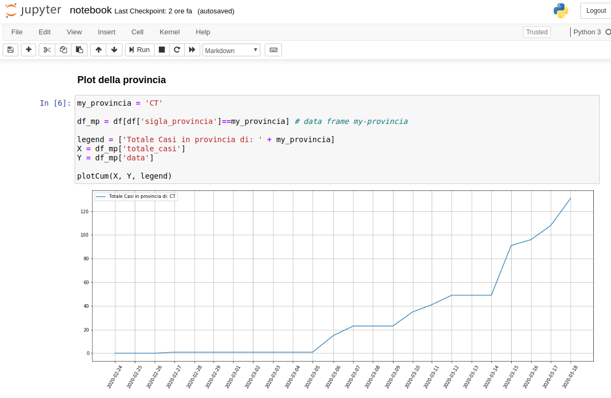
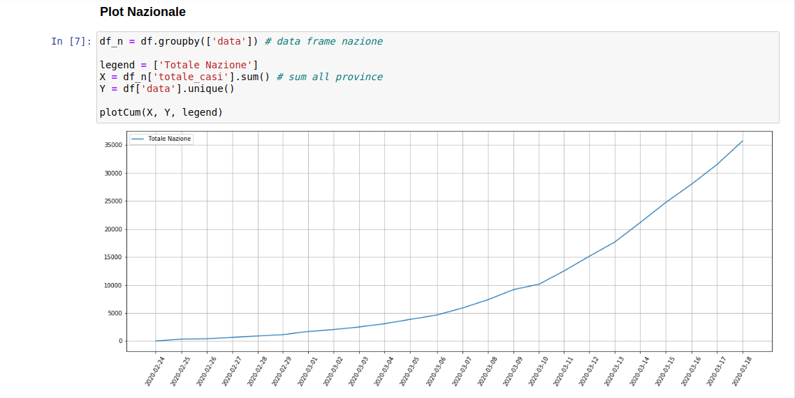

# Covid-19-it-province
Questo notebook analizza i dati aggiornati dalla Protezione Civile sul numero di contagi di <b>Covid-19</b> sulla suddivisione in province, in Italia. 
È possibile:
* Visualizzare i dati cumulativi giornalieri sul totale dei contagi in Italia
* Visualizzare i dati cumulativi giornalieri sul totale dei contagi in una specifica Provincia
* In aggiornamento...
  
Lo script fa uso dei dati ufficiali rilasciati dalla Protezione Civile (https://github.com/pcm-dpc/COVID-19).

# Pre-requisiti
* `python 3`
* `jupyter`

# Installazione
* Clonare scaricare la repository
* Eseguire `jupyter notebook` da linea di comando
* Aprire il file <b>notebook.ipynb</b> dall'interfaccia web di Jupyter
